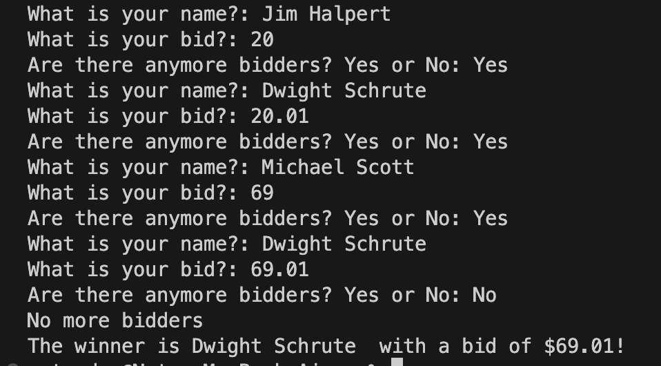

# silent-auction 
## 100 Days of Python Project: Silent Auction 

## Description: 
Welcome to the silent auction!

This program allows an infinite number of bidders to bid an amount. Once no more bidders remain, the program will find the highest bidder and declare it the winner!

## Screenshots:

## Credits: 
Idea from Angela Yu's 100 Days of Code: The Complete Python Pro Bootcamp 